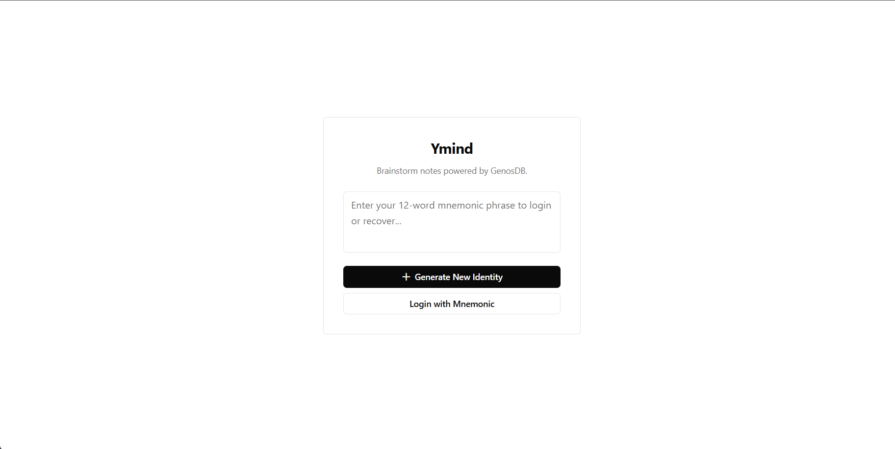
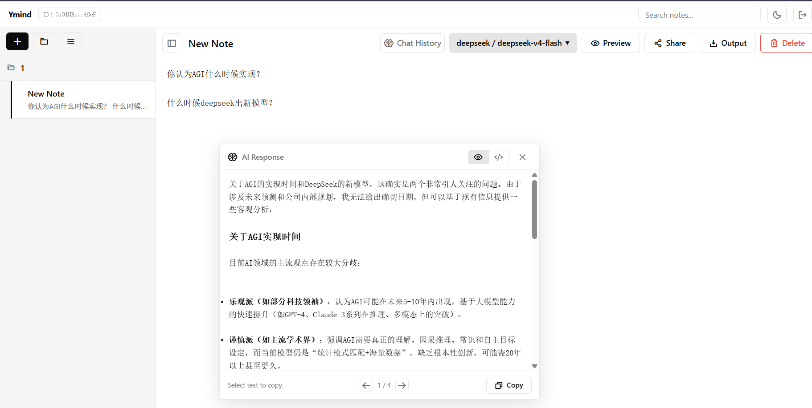

# Ymind

> Everything in one HTML file: notes, AI brainstorming, local-first. No accounts, no cloud, no catches. Decentralized and P2P means you own your data wherever you go. AI that's always there to think with you. Ymind is Your Mind.

## Demo




## Features

### Decentralized Sync (GenosDB)
- [GenosDB](https://github.com/estebanrfp/gdb) syncs your devices directly, peer-to-peer, using CRDT. No server in between
- Notes live in IndexedDB, encrypted with your mnemonic. Your words are the key
- Share notes via ACL: grant or revoke read/write access by address. You decide
- Real-time sync across browser tabs using GenosDB's subscribe API
- Works offline after the first load. Sync comes back automatically

### AI Brainstorm
- Type `?` in your note, hit `Enter` twice, and everything before `?` goes to the AI as context
- `Ctrl+Enter` sends the region between the last `?` and the current one to the AI
- `Ctrl+S` opens the history panel. `←` `→` scrolls through past AI responses
- AI outputs are saved as hidden notes, linked back via `parentNoteId`
- Works with any LLM: DeepSeek, OpenAI, Anthropic, Google Gemini...

### Identity-Based Security
- Your identity comes from a mnemonic (BIP39 wordlist)
- Passkey support for device authentication
- No usernames, no passwords. You are the key
- API keys never reach the browser (proxied through Vercel Edge Functions)

### Batch Operations
- Select multiple notes, delete or export them all at once
- Organize with folders

## Keyboard Shortcuts

| Shortcut | Action |
|----------|--------|
| `Enter` + `Enter` | Send text (from last `?` to cursor) to AI |
| `Ctrl` + `Enter` | Send the previous region to the current region |
| `Ctrl` + `S` | Open AI output history |
| `←` `→` | Navigate AI history when the history panel is open |

## Usage

### Option 1: Use it locally (no AI)

Start a local server and open Ymind.html in your browser:

```bash
# Method 1: using npx (requires Node.js)
npx serve .

# Method 2: using Python (requires Python 3)
python -m http.server 8080

# Then open http://localhost:5000 (or 8080) in your browser
```

### Option 2: Turn on AI brainstorm

#### Step 1: Deploy the LLM proxy to Vercel

```bash
cd ymind-worker
vercel deploy --prod
```

Vercel gives you a URL, something like `https://ymind-worker-xxx.vercel.app`.

#### Step 2: Add environment variables

```bash
# Generate a random token
vercel env add WORKER_ACCESS_TOKEN
# Input: the result of `openssl rand -hex 32`

# Add DeepSeek API key
vercel env add DEEPSEEK_API_KEY
# Input: your DeepSeek API key

# (optional) Add other provider keys
vercel env add OPENAI_API_KEY
vercel env add ANTHROPIC_API_KEY
```

#### Step 3: Update API_URL in Ymind.html

Open Ymind.html and find this line:

```javascript
const API_URL = '...';
```

Replace it with your Vercel URL:

```javascript
const API_URL = 'https://your-vercel-url.vercel.app/api/chat?key=YOUR_TOKEN';
```

#### Step 4: Start a local server

```bash
npx serve .   # or python -m http.server 8080
```

Then open `http://localhost:5000` (or `http://localhost:8080`) in your browser.

### Use a custom domain

#### Step 1: Add the domain in Vercel

```bash
vercel domains add your-domain.com
```

#### Step 2: Add a DNS record at your registrar

Vercel tells you what record to add (usually a CNAME or A record). Set it up in your domain registrar's DNS settings.

#### Step 3: Update API_URL in Ymind.html

```javascript
const API_URL = 'https://your-domain.com/api/chat?key=YOUR_TOKEN';
```

### Security Notes

Why go through Edge Functions?

- **API key protection**: Keys live in Vercel environment variables only. Never sent to the browser
- **Token auth**: Every request needs `?key=TOKEN`. Rate limiting blocks brute force
- **Rate limits**: 20 requests per minute per IP. 3 failures get you banned for an hour

## Tech Stack

- **Frontend**: Vanilla HTML/CSS/JS (zero framework)
- **Database**: [GenosDB](https://github.com/estebanrfp/gdb) - IndexedDB with identity-based security and peer-to-peer sync
- **Markdown**: [marked.js](https://marked.js.org/)
- **Icons**: [Phosphor Icons](https://phosphoricons.com/)
- **LLM Proxy**: Vercel Edge Functions, TypeScript

## Acknowledgements

- **[GenosDB](https://github.com/estebanrfp/gdb)** by Esteban Fuster Pozzi - Identity-based IndexedDB with CRDT sync and an ACL system. This project is built on the GenosDB example template, using its security manager for mnemonic/passkey auth, its map/subscribe API for reactive data, and its peer-to-peer sync capabilities.

- **[marked.js](https://marked.js.org/)** - Markdown parsing

- **[Phosphor Icons](https://phosphoricons.com/)** - Icon library

- **[Vercel](https://vercel.com/)** - Edge Functions for a secure LLM proxy
